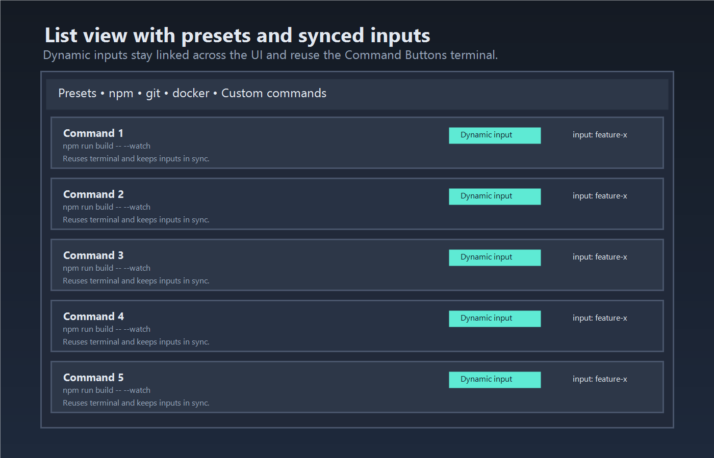

# Command Buttons Panel

Run your go-to terminal commands from a draggable grid in the Explorer. Add buttons once, pick how they run (copy + enter, copy only, or dynamic input), and reuse a dedicated terminal.

## Features
- Explorer side panel with grid and list views; collapse the list to focus on the grid.
- Drag to reorder commands and pick 1-4 grid columns.
- Three run modes: Copy + Enter (default), Copy only, and Dynamic input using a `${input}` placeholder with synced values across the UI.
- Dedicated terminal named **Command Buttons** that is created once and reused.
- Preset library for common npm/git/docker commands; add your own in seconds.
- Commands persist per workspace when one is open, otherwise globally; Settings Sync can keep them in sync.

## Preview

## Usage
1. Open the Explorer view and find **Command Buttons**.
2. Add a command (label optional). Use `${input}` to prompt for a value when running.
3. Click a command's mode chip to cycle its run mode; use the toolbar buttons to set a mode for every command.
4. Drag buttons in the grid to reorder; change the grid column count with the toolbar toggles.
5. Click any button to run it; the extension opens/reuses the **Command Buttons** terminal.

### Dynamic input
- Insert `${input}` anywhere in the command text.
- Enter the value in the per-command input; it stays synced between the grid and list.
- When run mode is **Dynamic input**, the placeholder is replaced before sending to the terminal.

### Predefined variables
Use these placeholders in commands (they mirror VS Code task variables):
- `${file}`: active file path.
- `${fileBasename}`: active file basename.
- `${fileBasenameNoExtension}`: active file basename with no extension.
- `${fileDirname}`: active file directory name.
- `${fileExtname}`: active file extension.
- `${lineNumber}`: first selected line number.
- `${lineNumbers}`: all selected line numbers, e.g. `41,46,80`.
- `${columnNumber}`: first selected column number.
- `${columnNumbers}`: all selected column numbers, e.g. `41,46,80`.
- `${selectedFile}`: first selected file or folder from the context menu.
- `${selectedFiles}`: selected file or folder list from the context menu or config, e.g. `"path/to/file1" "path/to/file2"`.
- `${selectedText}`: first selected text.
- `${selectedTextList}`: all selected text, e.g. `sl1 sl2`.
- `${selectedTextSection}`: all selected text sections, e.g. `sl1\nsl2`.
- `${selectedPosition}`: selected position, e.g. `21,6`.
- `${selectedPositionList}`: all selected positions, e.g. `45,6 80,18 82,5`.
- `${selectedLocation}`: first selected location, e.g. `21,6,21,10`.
- `${selectedLocationList}`: all selected locations, e.g. `21,6,21,10 22,6,22,10 23,6,23,10`.
- `${relativeFile}`: active file relative path.
- `${workspaceFolder}`: active workspace folder path.
- `${workspaceFolderBasename}`: active workspace folder basename.
- `${homedir}`: home directory of the current user.
- `${tmpdir}`: default directory for temporary files.
- `${platform}`: OS platform.
- `${env:PATH}`: value of the `PATH` environment variable.
- `${config:editor.fontSize}`: VS Code setting value.
- `${command:workbench.action.terminal.clear}`: run a VS Code command.
- `${input}`: prompt for a value as a parameter.
- `${input:defaultValue}`: prompt for a value with a default.

### Presets
- Use the preset dropdown to add a command from the built-in library (npm dev/build/test, git status, docker compose up).
- Edit or delete presets after adding them like any other command.

## Development
- `npm install`
- `npm run watch` to build on save, or `npm run compile` for a one-off build.
- Press **F5** in VS Code to launch an Extension Development Host and open the **Command Buttons** view.

## Packaging & Publishing
- `npm run package` builds `command-buttons-panel-x.y.z.vsix`.
- `npm run publish` publishes via `vsce`; set `VSCE_PAT` to your Marketplace token first.
- `.vscodeignore` excludes source and packaged `.vsix` files from the extension bundle.

## Release Notes
### 0.1.1
- Documented predefined variables and selection placeholders.
- Added Marketplace preview screenshots.
- Cleaned up README encoding artifacts.

### 0.1.0
- Marketplace metadata and docs refreshed for release.
- Added VSCE scripts for packaging/publishing.
- Exclude packaged `.vsix` files from extension bundles.

### 0.0.1
- Initial release with Explorer view, add/run/delete commands, dedicated terminal, and basic UI.

## License
[MIT](LICENSE)
